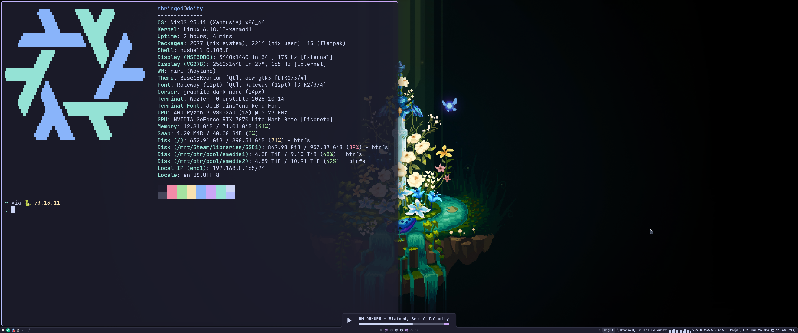

# About
These are my personal dotfiles for all of my systems. Here you can see how I use and maintain selfhosting, gaming, and personal computing software reproducibly across multiple systems.

# Screenshots
Here are screenshots of a few different examples of desktop configurations made from this repository.

https://github.com/Shringe/nixdots/tree/6775a78d32ac5616a8f23297975b0478208bf916

